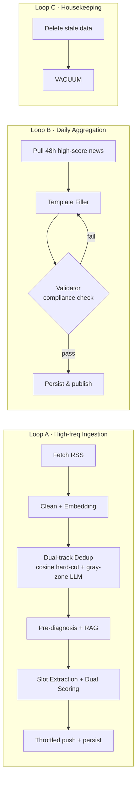

<div align="center">

# ⚡ AI Morning Briefing

**A near-enterprise-grade, personal AI news hub built for geeks & developers**

Auto-ingest · Persona-driven · Dual-axis scoring · Semantic dedup · Premium light dashboard

<br>


<br>

[Features](#-features) · [Tech Stack](#️-tech-stack) · [Quick Start](#-quick-start) · [Main Loops](#-system-loops) · [Contributing](#-contributing)

[中文文档](./README.zh-CN.md)

</div>

---

## 📖 Overview

**AI Morning Briefing** is a near-enterprise-grade *personal AI news hub* built for geeks and developers.

It automatically ingests data from high-quality sources and, guided by **your personal persona**, runs a **custom LLM pipeline** to perform deep slot extraction, dual-axis scoring, semantic deduplication, and intelligent pre-diagnosis. The result is delivered through a beautifully designed **premium light web dashboard** (or DingTalk push) as a coherent, professional, full-picture Markdown tech briefing.

> 💡 Unlike “yet another RSS reader”, the core value here is **noise filtering**: only the high-signal items that truly match your technical taste make it to your screen — structured and ready to read.

---

## ✨ Features

<table>
<tr>
<td width="50%" valign="top">

### 🏗️ Native Linear Workflow

Dropped the heavy LangGraph dependency in favor of a lightweight, fully controllable native pipeline with a built-in **feedback-loop retry mechanism** that guarantees fully compliant Markdown output.

</td>
<td width="50%" valign="top">

### 🗂️ Structured Slot Extraction

Replaces vague summarization. A `slot_extractor` forces the LLM to extract **event category, key entities, and hard metrics** into structured slots, keeping information highly controllable.

</td>
</tr>
<tr>
<td width="50%" valign="top">

### ⚖️ Dual-axis Scoring

Measures value across two independent axes — **Tech Utility** and **Macro Impact** — and persists the scoring rationale for a more scientific noise filter.

</td>
<td width="50%" valign="top">

### 🧬 Efficient NumPy Dedup (Simple First)

Introduces Embedding-based features without a heavy external vector DB. Uses in-memory **NumPy brute-force TopK recall + cosine similarity** to catch “same story, different headline” duplicates.

</td>
</tr>
<tr>
<td width="50%" valign="top">

### 🛡️ Sliding Push Throttle

An entity-tag-based in-memory debounce window. Bursts of similar high-score breaking news are circuit-broken and gracefully merged — no more notification spam.

</td>
<td width="50%" valign="top">

### 🤖 Prompts & Persona as Assets

All prompts (including your `persona.txt`) live in `backend/prompts/`, so you can tune the AI’s taste and workflow as easily as editing a text file.

</td>
</tr>
</table>

### ✨ Premium Light Frontend

A fully rebuilt Vue 3 interface that **leaves dark mode behind** in favor of a premium light **glassmorphism** design. It features a pixel-perfect “Today’s Featured” card, an **animated interactive SVG score ring**, and a **calendar heatmap**, delivering a reading experience akin to a high-end digital magazine.

---

## 🛰️ Tech Stack

| Layer | Stack |
| --- | --- |
| **Backend Engine** | Python 3.12 + FastAPI + APScheduler + SQLAlchemy<br>(no LangChain / LangGraph lock-in) |
| **AI Infrastructure** | OpenAI-compatible LLM + text Embedding vectors + DuckDuckGo RAG search |
| **Frontend** | Vue 3 + Vite + Vue Router + DOMPurify<br>(**premium light glassmorphism theme**) |
| **Database** | Dependency-free local SQLite |

---

## 📦 Quick Start

### 1. Prerequisites

> The backend recommends [uv](https://github.com/astral-sh/uv) for blazing-fast dependency management.

```bash
# Clone the repo
git clone https://github.com/yourusername/briefing_generation.git
cd briefing_generation

# Install backend deps
cd backend && uv sync

# Install frontend deps
cd ../frontend && npm install
```

### 2. Configuration

```bash
cd backend
cp .env.example .env
```

Fill in the key settings in `backend/.env`:

```ini
# --- LLM core ---
LLM_API_KEY=your_api_key_here
LLM_BASE_URL=https://api.openai.com/v1
LLM_MODEL=gpt-4o

# --- Embedding dedup ---
EMBEDDING_MODEL=text-embedding-3-small
DEDUP_PASS_THRESHOLD=0.80
DEDUP_REJECT_THRESHOLD=0.95

# --- Push throttle ---
PUSH_THROTTLE_WINDOW=1800
PUSH_THROTTLE_MAX=3
```

> 🎯 **Personalize**: edit `backend/prompts/persona.txt` to define your stack and preferences — the assistant filters news based on this file.

### 3. Run

```bash
# Start the backend API + scheduler
cd backend
uv run uvicorn briefing.main:app --reload --port 8000

# Start the frontend dev server
cd frontend
npm run dev
```

| Service | URL |
| --- | --- |
| 🌐 Frontend | http://localhost:5173 |
| 📚 API Docs | http://localhost:8000/docs |

---

## 📅 System Loops

The backend is driven by APScheduler and split into three pipeline loops:



- **Loop A — High-frequency ingestion**: fetch → clean → Embedding → dual-track dedup (cosine hard-cut + gray-zone LLM arbitration) → pre-diagnosis / RAG → slot extraction + dual-axis scoring → throttled push & persist.
- **Loop B — Daily briefing aggregation**: runs each morning; pulls 48h high-score news → fills the template → Validator compliance check (e.g. Mermaid correctness) → feedback retry on failure → publish.
- **Loop C — Housekeeping**: periodically deletes stale SQLite data and runs `VACUUM` to reclaim space.

---

## 📁 Project Structure

```
briefing_generation/
├── backend/
│   ├── briefing/          # FastAPI app & pipeline
│   ├── prompts/           # Prompts-as-assets + persona.txt
│   └── tests/             # Unit tests
└── frontend/              # Vue 3 premium light dashboard
```

---

## 🤝 Contributing

Pull Requests and Issues are welcome! Please make sure all unit tests pass before submitting:

```bash
cd backend
uv run pytest tests/ -v
```

---

## 📄 License

Released under the [MIT License](LICENSE).

<div align="center">
<br>

If this project helps you, please consider giving it a ⭐

</div>
