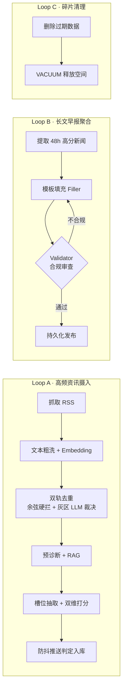

<div align="center">

# ⚡ AI Morning Briefing

**专属于极客与开发者的准企业级·个人 AI 资讯中枢**

自动采集 · 画像驱动 · 双维打分 · 语义去重 · 高端浅色仪表盘

<br>


<br>

[核心特性](#-核心特性) · [技术架构](#️-技术架构) · [快速开始](#-快速开始) · [系统主循环](#-系统主循环) · [贡献指南](#-参与贡献)

</div>

---

## 📖 项目简介

**AI Morning Briefing** 是一个面向极客与开发者的准企业级「个人专属 AI 资讯中枢」。

它能从高质量信息源自动采集数据，依据**你的个人画像**，通过**大模型自定义流水线**进行深度槽位提取、双维打分、语义去重与智能预诊断，最终通过一个极具设计感的**高端浅色 Web 仪表盘**或**钉钉推送**，为你呈现连贯、专业的全景 Markdown 科技晨报。

> 💡 与“再来一个 RSS 阅读器”不同，本项目的核心是**「过滤噪音」**：只把真正匹配你技术口味的高价值信息，结构化地送到你面前。

---

## ✨ 核心特性

<table>
<tr>
<td width="50%" valign="top">

### 🏗️ 原生高效流水线
Linear Workflow

移除繁重的 LangGraph 依赖，采用轻量、可掌控的原生线性管线，内置**带反馈的多次重试机制**，确保 Markdown 生成完美合规。

</td>
<td width="50%" valign="top">

### 🗂️ 结构化槽位提取
Slot Extraction

抛弃发散的总结逻辑，通过 `slot_extractor` 强制大模型提取**事件分类、关键实体、硬指标**等结构化槽位，信息高度可控。

</td>
</tr>
<tr>
<td width="50%" valign="top">

### ⚖️ 双维并轨打分
Dual-axis Scoring

从**技术实用分（Tech Utility）**与**宏观影响分（Macro Impact）**两个独立维度衡量价值，并持久化评分理由，过滤更科学。

</td>
<td width="50%" valign="top">

### 🧬 NumPy 高效去重
Simple First

引入 Embedding 向量化特征，不依赖重型向量数据库，采用内存级 **NumPy 暴力 TopK 召回 + 余弦相似度**，精准捕捉“换汤不换药”的重复新闻。

</td>
</tr>
<tr>
<td width="50%" valign="top">

### 🛡️ 滑动防抖推送
Push Throttle

基于实体标签的内存级防抖窗口，短时间同类高分突发新闻会被熔断拦截并优雅合并，告别刷屏。

</td>
<td width="50%" valign="top">

### 🤖 资产化 Prompt 与画像
Prompt as Asset

所有提示词（含个人偏好 `persona.txt`）分离到 `backend/prompts/`，像编辑文本一样随时调教 AI 的品味与工作流。

</td>
</tr>
</table>

### ✨ 极简高端浅色前端（Premium Light）

彻底重构的 Vue 3 界面，**告别深空暗色**，引入高端浅色**玻璃拟态（Glassmorphism）**。包含像素级还原的「今日精选卡片」、**SVG 动态交互评分环**、以及**日历热力图**，提供宛如高端数字杂志般的阅读体验。

---

## 🛰️ 技术架构

| 层 | 技术选型 |
| --- | --- |
| **后端引擎** | Python 3.12 + FastAPI + APScheduler + SQLAlchemy<br>（无 LangChain / LangGraph 绑架） |
| **AI 基础设施** | 兼容 OpenAI 规范的 LLM + 文本 Embedding 向量 + DuckDuckGo RAG 搜索 |
| **前端界面** | Vue 3 + Vite + Vue Router + DOMPurify<br>（**高端浅色玻璃拟态主题**） |
| **数据库** | 无外部依赖的极简本地 SQLite |

---

## 📦 快速开始

### 1. 环境准备

> 后端推荐使用 [uv](https://github.com/astral-sh/uv) 进行极速依赖管理。

```bash
# 克隆仓库
git clone https://github.com/yourusername/briefing_generation.git
cd briefing_generation

# 后端依赖安装
cd backend && uv sync

# 前端依赖安装
cd ../frontend && npm install
```

### 2. 环境配置

```bash
cd backend
cp .env.example .env
```

在 `backend/.env` 中填写关键配置项：

```ini
# --- LLM 核心配置 ---
LLM_API_KEY=your_api_key_here
LLM_BASE_URL=https://api.openai.com/v1
LLM_MODEL=gpt-4o

# --- Embedding 去重 ---
EMBEDDING_MODEL=text-embedding-3-small
DEDUP_PASS_THRESHOLD=0.80
DEDUP_REJECT_THRESHOLD=0.95

# --- 防抖推送 ---
PUSH_THROTTLE_WINDOW=1800
PUSH_THROTTLE_MAX=3
```

> 🎯 **个性化调教**：直接修改 `backend/prompts/persona.txt` 定义你的技术栈与偏好，AI 助理会据此为你过滤新闻。

### 3. 一键启动

```bash
# 启动后端 API 与调度任务
cd backend
uv run uvicorn briefing.main:app --reload --port 8000

# 启动前端开发服务器
cd frontend
npm run dev
```

| 服务 | 地址 |
| --- | --- |
| 🌐 前端界面 | http://localhost:5173 |
| 📚 后端 API 文档 | http://localhost:8000/docs |

---

## 📅 系统主循环

系统后端由 APScheduler 驱动，分为三个循环管线：



- **Loop A（高频资讯摄入）**：抓取 → 粗洗 → Embedding → 双轨去重（余弦硬拦 + 灰区 LLM 裁决）→ 预诊断/RAG → 槽位抽取 + 双维打分 → 防抖推送入库。
- **Loop B（长文早报聚合）**：每早定时执行，提取过去 48h 高分新闻 → 模板填充 → Validator 合规审查（如 Mermaid 正确性）→ 不合规带 Feedback 退回重做 → 发布。
- **Loop C（碎片清理）**：定期删除过期 SQLite 数据并执行 `VACUUM` 释放空间。

---

## 📁 目录结构

```
briefing_generation/
├── backend/
│   ├── briefing/          # FastAPI 应用与流水线
│   ├── prompts/           # 资产化提示词 + persona.txt
│   └── tests/             # 单元测试
└── frontend/              # Vue 3 高端浅色仪表盘
```

---

## 🤝 参与贡献

欢迎提交 Pull Request 或 Issue！提交代码前请确保通过所有单元测试：

```bash
cd backend
uv run pytest tests/ -v
```

---

## 📄 开源协议

本项目基于 [MIT License](LICENSE) 开源。

<div align="center">
<br>

If this project helps you, please consider giving it a ⭐

</div>
