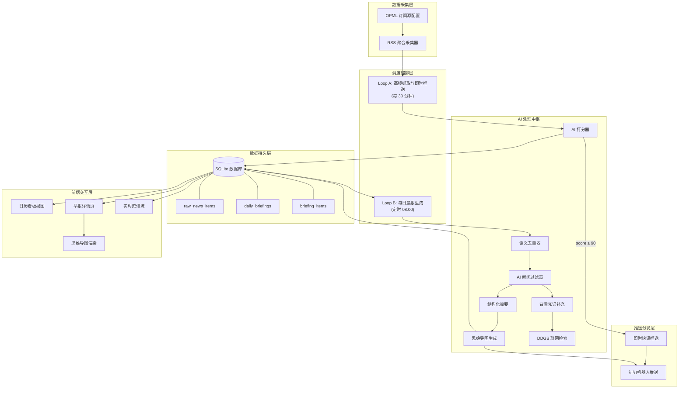
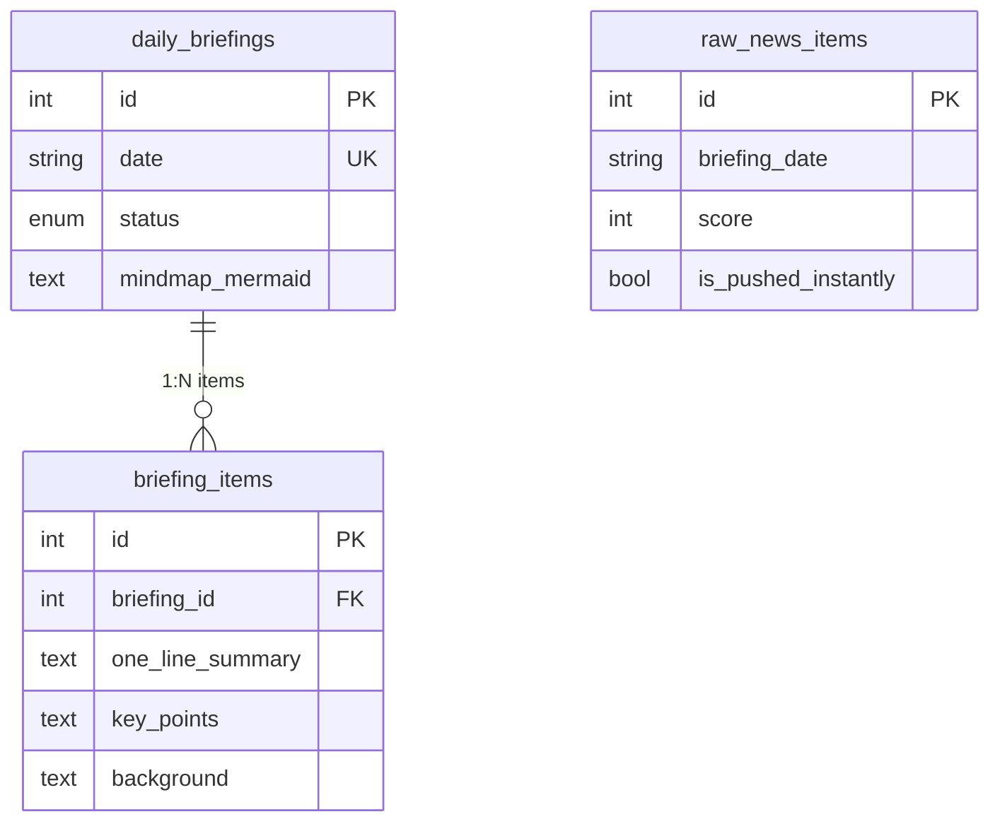
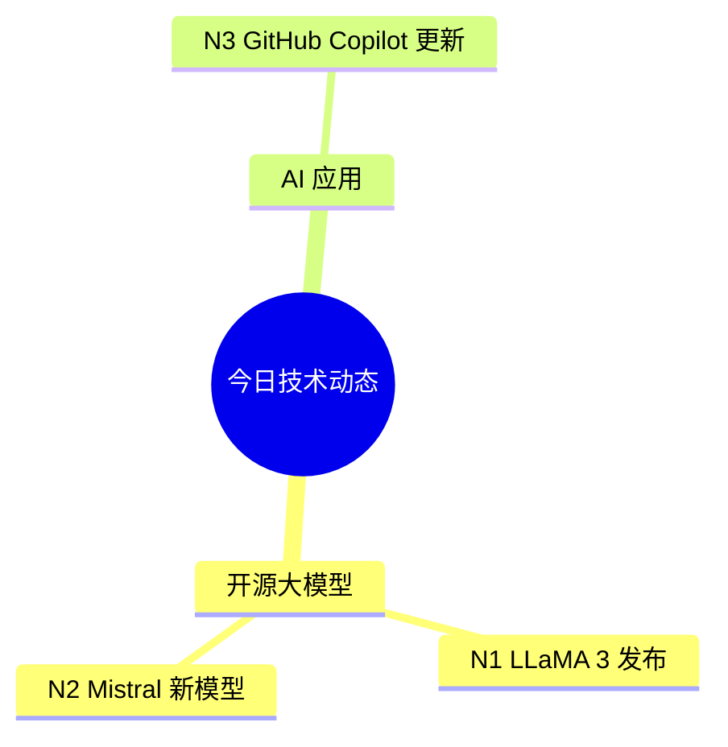
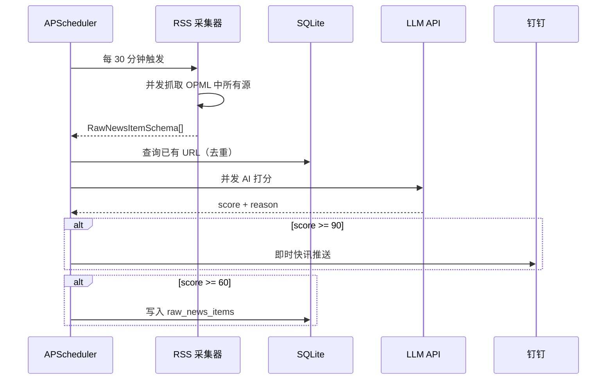
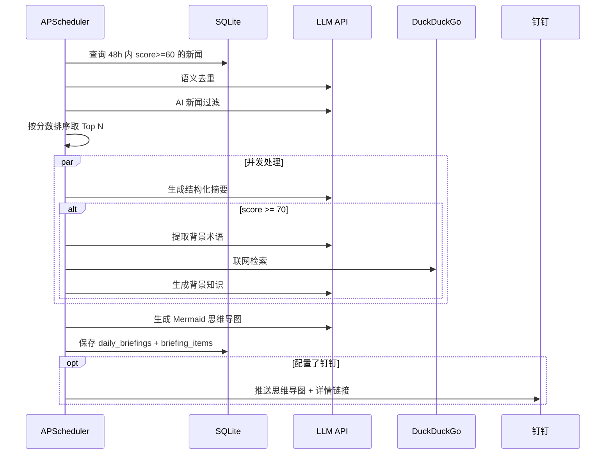

---

# 📐 V0.2 版本设计文档：智能 AI 开发者早报系统

> **版本**：0.2  
> **更新日期**：2026-05-25  
> **状态**：已实现  

## 1. 系统概述

本系统是一款面向 AI 开发者、研究员及科技爱好者的自动化新闻聚合与智能日报生成平台。系统通过 RSS 多源订阅进行高频数据采集，利用大模型（OpenAI-compatible API）对新闻进行打分、过滤、去重、摘要、背景补充和思维导图生成，最终通过前端看板和钉钉推送将精选日报触达用户。

### 1.1 核心价值

- **信息过载解决方案**：从海量 RSS 源中智能筛选 AI 相关高价值新闻
- **双轨推送机制**：高频抓取即时推送 + 每日精选晨报汇总
- **AI 深度加工**：语义去重、结构化摘要、联网背景补充、技术思维导图
- **可视化展示**：前端日历看板 + Mermaid 思维导图可交互渲染

### 1.2 技术栈

| 层级     | 技术选型                                                        |
| -------- | --------------------------------------------------------------- |
| 后端语言 | Python 3.12                                                     |
| Web 框架 | FastAPI                                                         |
| ORM      | SQLAlchemy 2.x                                                  |
| 数据库   | SQLite（默认），支持 PostgreSQL                                 |
| LLM 调用 | OpenAI Python SDK（兼容 DeepSeek、智谱等 OpenAI-compatible API）|
| 联网检索 | DDGS (DuckDuckGo Search)                                        |
| RSS 解析 | feedparser + listparser (OPML)                                  |
| 定时调度 | APScheduler（BackgroundScheduler）                              |
| 配置管理 | pydantic-settings + `.env` 文件                                 |
| 前端框架 | Vue 3 + Vue Router 4                                            |
| 构建工具 | Vite 8                                                          |
| 图表渲染 | Mermaid.js 11                                                   |
| 安全净化 | DOMPurify                                                       |
| 测试框架 | pytest + pytest-cov                                             |
| 包管理   | uv（后端）、npm（前端）                                        |

---

## 2. 系统架构

### 2.1 整体架构图



### 2.2 双轨推送模型

系统采用 **Loop A / Loop B** 双轨并行架构：

| 轨道   | 名称               | 触发频率         | 职责                                   |
| ------ | ------------------ | ---------------- | -------------------------------------- |
| Loop A | 高频抓取与即时推送 | 每 30 分钟       | RSS 抓取 → AI 打分 → 入库 → 即时快讯  |
| Loop B | 每日晨报聚合推送   | 每天 08:00       | 去重 → 过滤 → 摘要 → 背景 → 思维导图  |

---

## 3. 目录结构

```text
briefing_generation/
├── src/briefing/                 # 后端核心代码包
│   ├── __init__.py
│   ├── main.py                   # FastAPI 应用入口 + 生命周期管理
│   ├── config.py                 # 集中配置管理（pydantic-settings）
│   ├── database.py               # 数据库引擎与 Session 管理
│   ├── models.py                 # SQLAlchemy ORM 模型定义
│   ├── ai/                       # AI 处理中枢模块
│   │   ├── __init__.py
│   │   ├── client.py             # LLM 客户端封装
│   │   ├── scorer.py             # AI 打分模块
│   │   ├── filter.py             # AI 新闻过滤模块
│   │   ├── deduplicator.py       # 语义去重模块
│   │   ├── summarizer.py         # 结构化摘要模块
│   │   ├── enricher.py           # 背景知识补充模块（含联网检索）
│   │   └── mindmap.py            # 思维导图生成模块
│   ├── api/                      # FastAPI 路由层
│   │   ├── __init__.py
│   │   └── routes.py             # RESTful API 路由定义
│   ├── collectors/               # 数据采集层
│   │   ├── __init__.py
│   │   ├── base.py               # 采集器标准化数据模型
│   │   └── rss.py                # RSS 全网聚合采集器
│   ├── push/                     # 推送分发层
│   │   ├── __init__.py
│   │   └── dingtalk.py           # 钉钉机器人推送
│   └── scheduler/                # 调度编排层
│       ├── __init__.py
│       └── jobs.py               # 双轨推送流程编排
├── frontend/                     # Vue 3 前端
│   ├── src/
│   │   ├── main.js               # 前端入口 + 路由注册
│   │   ├── App.vue               # 根组件（导航栏 + Toast）
│   │   ├── api.js                # 后端 API 封装
│   │   ├── style.css             # 全局设计系统变量与基础样式
│   │   └── views/
│   │       ├── CalendarView.vue  # 日历看板视图
│   │       └── BriefingDetail.vue# 早报详情页（含思维导图/资讯流）
│   ├── vite.config.js            # Vite 构建配置（含 API 代理）
│   └── package.json              # 前端依赖清单
├── tests/                        # 后端单元测试
│   ├── test_collectors.py        # RSS 采集器测试
│   ├── test_ai_processor.py      # AI 处理模块测试
│   ├── test_dingtalk_push.py     # 钉钉推送测试
│   └── test_scheduler_jobs.py    # 调度编排测试
├── test/                         # 原始采集脚本参考
│   ├── github_trending.py
│   ├── HackerNews_front.py
│   └── huggingfacedailypaper.py
├── data/                         # 数据目录
│   └── briefing.db               # SQLite 数据库文件
├── data_source/                  # 数据源配置
│   └── rss.opml                  # RSS 订阅源列表（OPML 格式）
├── docs/                         # 文档目录
│   ├── 需求文档.md
│   └── V0.2版本设计文档.md       # 本文档
├── pyproject.toml                # Python 项目配置
├── uv.lock                       # uv 依赖锁定文件
├── .env.example                  # 环境变量模板
├── .gitignore
└── README.md
```

---

## 4. 详细模块设计

### 4.1 配置管理模块 (`config.py`)

#### 4.1.1 设计思路

使用 `pydantic-settings` 的 `BaseSettings` 实现集中配置管理，所有配置项从 `.env` 文件自动加载，并通过 `@lru_cache` 保证全局单例。

#### 4.1.2 配置项清单

| 分组         | 配置项                       | 类型     | 默认值                                          | 说明                         |
| ------------ | ---------------------------- | -------- | ----------------------------------------------- | ---------------------------- |
| LLM          | `llm_api_key`                | `str`    | *必填*                                          | 大模型 API Key               |
| LLM          | `llm_base_url`               | `str`    | `https://api.openai.com/v1`                     | API Base URL                 |
| LLM          | `llm_model`                  | `str`    | `gpt-4o`                                        | 模型名称                     |
| 数据库       | `database_url`               | `str`    | `sqlite:///./data/briefing.db`                  | 数据库连接字符串             |
| 数据采集     | `rss_opml_path`              | `str`    | `data_source/rss.opml`                          | OPML 文件路径                |
| 数据采集     | `rss_fetch_interval_minutes` | `int`    | `30`                                            | RSS 高频抓取间隔（分钟）     |
| 数据采集     | `rss_lookback_minutes`       | `int`    | `120`                                           | RSS 抓取回溯窗口（分钟）     |
| 数据采集     | `llm_concurrency`            | `int`    | `5`                                             | LLM 并发调用数               |
| 数据采集     | `ai_filter_enabled`          | `bool`   | `true`                                          | 是否启用 AI 过滤             |
| 数据采集     | `ai_filter_batch_size`       | `int`    | `50`                                            | AI 过滤批大小                |
| 数据采集     | `ai_filter_target_audience`  | `str`    | `AI 开发者、AI 研究员和关注大模型应用的技术团队`| 目标读者群体                 |
| 数据采集     | `collect_max_items`          | `int`    | `20`                                            | 晨报最多收录条数             |
| 推送阈值     | `instant_push_threshold`     | `int`    | `90`                                            | 即时推送分数阈值             |
| 推送阈值     | `fetch_store_threshold`      | `int`    | `60`                                            | 入库分数阈值                 |
| 推送阈值     | `ddgs_trigger_threshold`     | `int`    | `70`                                            | 触发联网检索阈值             |
| 调度         | `schedule_hour`              | `int`    | `8`                                             | 晨报执行小时                 |
| 调度         | `schedule_minute`            | `int`    | `0`                                             | 晨报执行分钟                 |
| 调度         | `timezone`                   | `str`    | `Asia/Shanghai`                                 | 系统时区                     |
| 推送         | `frontend_base_url`          | `str`    | `http://localhost:5173`                         | 前端访问地址                 |
| 推送         | `dingtalk_webhook_url`       | `str?`   | `None`                                          | 钉钉 Webhook URL（可选）     |
| 推送         | `dingtalk_secret`            | `str?`   | `None`                                          | 钉钉加签密钥（加签模式）     |
| 推送         | `dingtalk_keyword`           | `str`    | `【日报】`                                      | 钉钉自定义关键词（关键词模式）|
| 推送         | `dingtalk_timeout`           | `int`    | `10`                                            | 钉钉推送超时（秒）           |
| 推送         | `dingtalk_summary_max_items` | `int`    | `20`                                            | 钉钉摘要最大条数             |

#### 4.1.3 关键实现

```python
class Settings(BaseSettings):
    model_config = {"env_file": ".env", "env_file_encoding": "utf-8"}

@lru_cache
def get_settings() -> Settings:
    return Settings()
```

---

### 4.2 数据库模块 (`database.py` + `models.py`)

#### 4.2.1 数据库管理

- **惰性单例引擎**：`get_engine()` 使用模块级全局变量实现惰性初始化
- **SQLite 适配**：自动创建数据目录、启用 `check_same_thread=False` 以支持多线程
- **PostgreSQL 适配**：启用 `pool_pre_ping=True` 连接预检
- **Session 工厂**：`get_session()` 提供独立的数据库会话

#### 4.2.2 ORM 模型

系统定义了 3 个核心数据表和 1 个状态枚举：

##### `BriefingStatus`（早报状态枚举）

```python
class BriefingStatus(str, enum.Enum):
    COLLECTING  = "collecting"   # 采集中
    PROCESSING  = "processing"   # AI 处理中
    COMPLETED   = "completed"    # 已完成
    FAILED      = "failed"       # 失败
```

##### 表 `raw_news_items`（原始新闻条目）

由 Loop A 采集器写入，存储打分后的原始新闻数据。

| 字段                | 类型         | 说明                     |
| ------------------- | ------------ | ------------------------ |
| `id`                | Integer (PK) | 自增主键                 |
| `source`            | String(100)  | 新闻来源名称             |
| `title`             | String(500)  | 新闻标题                 |
| `url`               | String(1000) | 原文链接                 |
| `description`       | Text         | 描述/摘要                |
| `raw_content`       | Text         | 原文内容                 |
| `score`             | Integer      | AI 评分 (0-100)          |
| `extra_data`        | Text (JSON)  | 附加字段（含打分理由）   |
| `published_at`      | String(50)   | 发布时间                 |
| `is_pushed_instantly`| Boolean     | 是否已即时推送           |
| `collected_at`      | DateTime     | 采集入库时间 (UTC)       |
| `briefing_date`     | String(10)   | 所属日期 (YYYY-MM-DD)    |

##### 表 `daily_briefings`（每日早报聚合）

Loop B 生成的每日早报主记录。

| 字段               | 类型         | 说明                     |
| ------------------ | ------------ | ------------------------ |
| `id`               | Integer (PK) | 自增主键                 |
| `date`             | String(10)   | 日期 (YYYY-MM-DD)，唯一 |
| `status`           | Enum         | 早报状态                 |
| `mindmap_mermaid`  | Text         | Mermaid 思维导图代码     |
| `summary_overview` | Text         | 顶部概览文本             |
| `created_at`       | DateTime     | 创建时间 (UTC)           |
| `updated_at`       | DateTime     | 更新时间 (UTC)           |

##### 表 `briefing_items`（早报子项）

与 `daily_briefings` 通过外键 `briefing_id` 关联，按 `priority` 排序。

| 字段               | 类型         | 说明                     |
| ------------------ | ------------ | ------------------------ |
| `id`               | Integer (PK) | 自增主键                 |
| `briefing_id`      | Integer (FK) | 关联的早报 ID            |
| `source`           | String(100)  | 来源                     |
| `title`            | String(500)  | 标题                     |
| `url`              | String(1000) | 原文链接                 |
| `one_line_summary` | Text         | 一句话结论               |
| `key_points`       | Text (JSON)  | 3 个核心要点             |
| `importance`       | Text         | 为什么重要               |
| `background`       | Text         | AI 补充的背景知识        |
| `category`         | String(100)  | 分类 Tag                 |
| `priority`         | Integer      | 排序优先级（越小越靠前） |

#### 4.2.3 表关系



---

### 4.3 数据采集层 (`collectors/`)

#### 4.3.1 标准化数据模型 (`base.py`)

所有采集器的输出统一为 `RawNewsItemSchema`（Pydantic BaseModel）：

```python
class RawNewsItemSchema(BaseModel):
    source: str          # 来源名称
    title: str           # 标题
    url: str             # URL
    description: str     # 描述
    raw_content: str     # 原文内容
    score: int = 0       # AI 评分（采集时为 0，打分后填充）
    extra_data: dict     # 附加数据
    published_at: str    # 发布时间
```

#### 4.3.2 RSS 聚合采集器 (`rss.py`)

**职责**：解析 OPML 订阅源配置文件，并发抓取所有 RSS Feed，过滤出指定时间窗口内的新内容。

**核心函数**：

| 函数                | 说明                                             |
| ------------------- | ------------------------------------------------ |
| `parse_opml(path)`  | 解析 OPML 文件，返回 `[{name, url}]` 列表       |
| `fetch_feed(...)`   | 抓取单个 RSS 源，按 `lookback_minutes` 过滤时间 |
| `fetch_all_feeds()` | 并发抓取 OPML 中所有 RSS 源（最多 20 线程）      |

**关键设计**：

- **时间解析**：使用 `calendar.timegm()` 将 feedparser 的 `time.struct_time` 转为 UTC `datetime`，避免本地时区偏移
- **并发控制**：使用 `ThreadPoolExecutor`，并发数取 `min(20, 源数量)`
- **容错设计**：单个 Feed 抓取失败不影响其他源，仅记录 WARNING 日志
- **内容截断**：标题限 500 字符、URL 限 1000 字符、描述限 2000 字符、原文限 5000 字符

#### 4.3.3 数据源配置

数据源通过 `data_source/rss.opml` 文件配置，采用标准 OPML 格式，支持批量导入 RSS 订阅源。

---

### 4.4 AI 处理中枢 (`ai/`)

#### 4.4.1 LLM 客户端 (`client.py`)

统一封装所有 LLM 调用，兼容所有 OpenAI-compatible API。

| 函数                     | 说明                                |
| ------------------------ | ----------------------------------- |
| `get_llm_client()`       | 创建 OpenAI 兼容客户端实例          |
| `chat_completion(...)`   | 通用 Chat Completion 请求           |
| `chat_completion_json()` | Chat Completion + JSON 模式自动解析 |

**关键设计**：
- 支持 JSON mode (`response_format={"type": "json_object"}`)
- 默认 `temperature=0.3`，保证输出稳定性
- 统一错误处理与 token 用量日志

#### 4.4.2 AI 打分模块 (`scorer.py`)

**职责**：为每条 RSS 新闻评估分数 (0-100)，用于决定即时推送或入库。

**评分标准**：

| 分数段   | 含义                                           |
| -------- | ---------------------------------------------- |
| 90-100 分| 重大行业影响力的突破性新闻                     |
| 70-89 分 | 值得关注的重要技术更新、优秀开源项目            |
| 60-69 分 | 常规技术动态、小版本更新                        |
| 0-59 分  | 非 AI 相关、水文、PR 稿件                       |

**输出**：更新 `item.score` 和 `item.extra_data["score_reason"]`

**分数阈值应用**：

```
score >= 90  → 即时推送到钉钉（Loop A）
score >= 70  → 触发 DDGS 联网检索补充背景（Loop B）
score >= 60  → 写入数据库候选（Loop A）
score < 60   → 丢弃不入库
```

#### 4.4.3 AI 新闻过滤器 (`filter.py`)

**职责**：使用 LLM 按目标读者群体筛选 AI 相关新闻，排除非 AI 内容。

**筛选规则**（Prompt 内嵌）：
1. 只保留与 AI 明确相关的新闻（大模型、ML、AI Agent、多模态、生成式 AI 等）
2. 优先根据标题判断，标题不足时结合描述
3. 排除泛前端、泛 DevOps、泛安全等无 AI 直接关系的新闻

**批处理设计**：
- 默认批大小 `batch_size=50`，大量新闻时分批调用 LLM
- 每批独立处理，单批失败时保留原始列表，不丢弃新闻
- 使用低温度 `temperature=0.1` 保证筛选一致性

#### 4.4.4 语义去重模块 (`deduplicator.py`)

**职责**：将来自不同平台但指向同一事件/项目/话题的新闻进行语义级合并。

**工作流程**：
1. 构建新闻摘要列表（来源 + 标题 + 描述前 100 字）
2. LLM 分析并分组（返回 `groups` 数组）
3. 每组选择 `primary_index`（信息最丰富的条目）作为代表
4. 未被任何组覆盖的条目单独保留

**容错**：LLM 调用失败时返回原始列表

#### 4.4.5 结构化摘要模块 (`summarizer.py`)

**职责**：将每条新闻转化为标准结构化摘要。

**输出结构**：

```json
{
    "one_line_summary": "一句话概括（中文，≤50字）",
    "key_points": ["核心要点1", "核心要点2", "核心要点3"],
    "importance": "为什么对开发者/研究员重要（1-2句）",
    "category": "分类标签"
}
```

**降级策略**：LLM 失败时返回 `{one_line_summary: 原标题, key_points: [], category: "其他"}`

#### 4.4.6 背景知识补充模块 (`enricher.py`)

**职责**：识别新闻中的专业术语、新项目/模型/公司，结合联网检索结果补充背景释义。

**三阶段工作流**：

```
Step 1: 术语提取 → LLM 从摘要中提取 ≤4 个关键词
        ↓ 失败时兜底：正则提取英文技术词
Step 2: 联网检索 → DDGS 每个术语搜索 3 条结果
Step 3: 背景生成 → LLM 结合检索结果撰写 ≤200 字 Markdown 背景
```

**核心函数**：

| 函数                                    | 说明                                 |
| --------------------------------------- | ------------------------------------ |
| `extract_background_terms(...)`         | LLM 提取关键术语（含正则兜底）       |
| `web_search(query, max_results)`        | DDGS 联网搜索                        |
| `collect_background_search_results(...)` | 批量联网检索                        |
| `enrich_background(...)`               | 完整背景补充流程                     |

**兜底术语提取规则** (`_fallback_terms`)：
- 正则匹配英文技术词：`[A-Za-z][A-Za-z0-9_.+-]{2,}`
- 排除常见无意义词：`the`, `and`, `for`, `model`, `platform` 等
- 去重后取前 N 个

#### 4.4.7 思维导图生成模块 (`mindmap.py`)

**职责**：分析当天所有新闻，提取共性主题，生成 Mermaid `mindmap` 代码。

**生成规则**（Prompt 内嵌）：
1. 按共性主题逻辑聚类（3-6 个分支）
2. 根节点为 `今日技术动态`
3. 每个叶子节点以 `N{编号}` 开头，用于前端节点跳转
4. 标签中不使用 Mermaid 特殊字符

**示例输出**：



**后处理**：
- 移除 LLM 可能输出的 ` ```mermaid ``` ` 包裹
- 校验是否包含 `mindmap` 关键字
- 失败时返回降级内容 `"mindmap\n  root((今日技术动态))\n    生成失败"`

---

### 4.5 调度编排层 (`scheduler/jobs.py`)

#### 4.5.1 Loop A: 高频抓取与即时推送 (`fetch_and_instant_push`)

**触发频率**：每 30 分钟（可配置）

**执行流程**：

```
1. 并发抓取所有 RSS 源 (fetch_all_feeds)
2. 基于 URL 去重（过滤 2 天内已入库的 URL）
3. 并发 AI 打分 (score_single_news × llm_concurrency)
4. 筛选入库与即时推送:
   - score >= 60 → 写入 raw_news_items
   - score >= 90 → 发送即时快讯到钉钉 + 标记 is_pushed_instantly
```

**即时快讯格式**（钉钉 Markdown）：

```
### ⚡ AI 重磅快讯 ({score}分)

**[{title}]({url})**

> {description}...

**上榜理由**：{score_reason}

*{source}*
```

#### 4.5.2 Loop B: 每日晨报聚合推送 (`generate_daily_briefing`)

**触发频率**：每天定时（默认 08:00，可配置）

**执行流程**：

```
1. 检查是否已生成（避免重复）
   - COMPLETED / PROCESSING → 跳过
   - FAILED → 清理旧子项，重新生成
2. 查询过去 48 小时内 score >= 60 的 raw_news_items
3. 语义去重 (deduplicate)
4. AI 新闻过滤 (filter_ai_related)，可配置关闭
5. 按分数排序取 Top N (collect_max_items)
6. 并发处理每条新闻：
   - 生成结构化摘要 (summarize_single)
   - score >= 70 时触发背景补充 (enrich_background)
7. 生成技术演进思维导图 (generate_mindmap)
8. 保存 daily_briefings + briefing_items
9. 推送钉钉（含思维导图图片 + 前端链接 + 文字兜底）
```

#### 4.5.3 任务恢复 (`mark_interrupted_briefings_failed`)

**触发时机**：应用启动时

**职责**：将上次进程中断遗留的 `PROCESSING` / `COLLECTING` 状态的早报标记为 `FAILED`，避免死锁。

#### 4.5.4 数据清理 (`cleanup_memory`)

**职责**：删除 7 天前的 `raw_news_items`，控制数据库体积。

> **注意**：此函数已定义但当前版本未注册到定时任务中。

---

### 4.6 API 路由层 (`api/routes.py`)

所有 API 路由注册在 `/api` 前缀下，使用 Pydantic 响应模型保证类型安全。

#### 4.6.1 API 端点清单

| 方法     | 路径                   | 说明                             | 响应模型                     |
| -------- | ---------------------- | -------------------------------- | ---------------------------- |
| `GET`    | `/api/briefings`       | 获取早报列表（按日期倒序）       | `list[BriefingListItem]`     |
| `GET`    | `/api/briefings/{date}`| 获取指定日期早报详情             | `BriefingDetailResponse`     |
| `POST`   | `/api/trigger`         | 手动触发抓取或晨报生成           | `TriggerResponse`            |
| `DELETE` | `/api/briefings/{date}`| 删除指定日期早报及关联数据       | `DeleteBriefingResponse`     |
| `GET`    | `/api/dates`           | 获取日历可用日期列表             | `list[{date, status, feed_count}]` |
| `GET`    | `/api/feed/{date}`     | 获取指定日期的实时采集资讯流     | `list[RawNewsItemResponse]`  |
| `GET`    | `/health`              | 健康检查端点                     | `{"status": "ok"}`           |

#### 4.6.2 触发 API 设计

`POST /api/trigger` 支持 `loop` 查询参数：

| 参数值     | 行为                                             |
| ---------- | ------------------------------------------------ |
| `loop=A`   | 异步触发 Loop A（后台线程），立即返回             |
| `loop=B`   | 同步执行 Loop B（生成晨报），完成后返回           |

#### 4.6.3 删除早报逻辑

`DELETE /api/briefings/{date}`：

1. 校验早报存在性（404 不存在）
2. 拒绝删除 `COLLECTING` / `PROCESSING` 状态的早报（409 冲突）
3. 级联删除：`briefing_items` → `raw_news_items` → `daily_briefings`
4. 事务保护：失败时回滚

#### 4.6.4 日历日期 API

`GET /api/dates` 合并两个数据源：

1. `raw_news_items` 按 `briefing_date` 分组统计数量
2. `daily_briefings` 获取状态

返回合并后的日期集合，按日期倒序排列。

#### 4.6.5 响应模型定义

```python
class BriefingItemResponse:
    id, source, title, url
    one_line_summary, key_points: list[str]
    importance, background, category, priority

class BriefingDetailResponse:
    id, date, status
    mindmap_mermaid, summary_overview
    items: list[BriefingItemResponse]

class BriefingListItem:
    id, date, status, summary_overview, item_count

class RawNewsItemResponse:
    id, source, title, url, description
    score, published_at, collected_at, is_pushed_instantly
```

---

### 4.7 推送分发层 (`push/dingtalk.py`)

#### 4.7.1 钉钉安全模式

系统支持钉钉机器人的两种安全设置，可同时启用：

| 安全模式       | 配置项              | 说明                                         |
| -------------- | ------------------- | -------------------------------------------- |
| **自定义关键词**（推荐）| `DINGTALK_KEYWORD`  | 所有推送消息自动注入关键词（默认 `【日报】`）|
| 加签           | `DINGTALK_SECRET`   | HMAC-SHA256 签名追加到 Webhook URL           |

> **重要**：钉钉机器人必须至少启用一种安全设置。使用"自定义关键词"模式时，消息的 `title` 或 `text` 中必须包含设置的关键词，否则消息会被钉钉服务端拒绝。

#### 4.7.2 推送内容构成

**晨报推送**：

```
┌──────────────────────────────────────┐
│  【日报】 {date} 技术演进思维导图      │  标题（含关键词）
│                                        │
│  ### 【日报】 {date} 技术演进思维导图   │  正文标题（含关键词）
│  []        │  Mermaid 图片（可点击跳转详情页）
│                                        │
│  如果图片无法点击：[查看完整早报]       │  兜底链接
│                                        │
│  #### 核心新闻摘要                     │  文字兜底
│  1. **新闻A**：摘要A                   │
│  2. **新闻B**：摘要B                   │
│  ...                                   │
└──────────────────────────────────────┘
```

**即时快讯**：

```
┌──────────────────────────────────────┐
│  【日报】 ⚡ AI 突发快讯：{title}      │  标题（含关键词）
│                                        │
│  ### 【日报】 ⚡ AI 重磅快讯 (95分)    │  正文（含关键词）
│  **[新闻标题](url)**                   │
│  > 新闻描述...                         │
│  **上榜理由**：打分理由                │
│  *来源名称*                            │
└──────────────────────────────────────┘
```

#### 4.7.3 核心函数

| 函数                                   | 说明                               |
| -------------------------------------- | ---------------------------------- |
| `_build_signed_webhook_url(...)`       | HMAC-SHA256 加签 URL 构建          |
| `_build_frontend_briefing_url(...)`    | 前端早报详情页 URL 构建            |
| `_build_mermaid_image_url(...)`        | Mermaid 图片渲染 URL（Base64 编码）|
| `_format_news_fallback(...)`           | 文字兜底摘要生成                   |
| `send_mindmap_to_dingtalk(...)`        | 完整推送执行（含 `keyword` 参数）  |

#### 4.7.4 安全设计

- **自定义关键词**：`keyword` 参数自动注入到消息 `title` 和 `text` 中，确保通过钉钉安全校验
- **加签模式**：使用 `HMAC-SHA256` + `Base64` 生成签名追加到 URL
- Webhook URL 中的 `access_token`、`secret`、`keyword` 均从环境变量读取
- 推送超时可配置，防止长时间阻塞

#### 4.7.5 即时快讯推送

除晨报推送外，Loop A 中 score ≥ 90 的新闻触发 `_send_instant_push()`，通过钉钉发送即时快讯 Markdown 消息，消息同样包含自定义关键词。

---

### 4.8 应用入口 (`main.py`)

#### 4.8.1 FastAPI 应用配置

```python
app = FastAPI(
    title="智能 AI 开发者早报系统",
    version="0.1.0",
    lifespan=lifespan,          # 异步生命周期管理
)
app.add_middleware(CORSMiddleware, allow_origins=["*"])  # CORS 全开放
app.include_router(router)     # 挂载 /api 路由
```

#### 4.8.2 生命周期管理 (`lifespan`)

**启动阶段**：
1. 初始化数据库表 (`init_db`)
2. 恢复中断的早报任务 (`mark_interrupted_briefings_failed`)
3. 注册 Loop A 定时任务（IntervalTrigger）
4. 注册 Loop B 定时任务（CronTrigger）
5. 启动调度器

**关闭阶段**：
1. 关闭调度器 (`scheduler.shutdown`)

---

### 4.9 前端交互层 (`frontend/`)

#### 4.9.1 技术架构

- **框架**：Vue 3 (Composition API + `<script setup>`)
- **路由**：Vue Router 4 (`createWebHistory`)
- **构建**：Vite 8（含 API 代理 `/api` → `localhost:8000`）
- **图表**：Mermaid.js（动态导入，暗色主题）
- **安全**：DOMPurify（HTML 净化）

#### 4.9.2 路由设计

| 路径              | 组件                | 说明           |
| ----------------- | ------------------- | -------------- |
| `/`               | `CalendarView.vue`  | 首页日历看板   |
| `/briefing/:date` | `BriefingDetail.vue`| 早报详情页     |

#### 4.9.3 设计系统 (`style.css`)

**暗色主题配色方案**：

| CSS 变量                   | 色值                  | 用途             |
| -------------------------- | --------------------- | ---------------- |
| `--color-bg-primary`       | `#0a0e1a`             | 页面主背景       |
| `--color-bg-secondary`     | `#111827`             | 次级背景         |
| `--color-bg-card`          | `rgba(17,24,39,0.8)`  | 卡片背景         |
| `--color-accent-indigo`    | `#6366f1`             | 主题色           |
| `--color-accent-violet`    | `#8b5cf6`             | 辅助色           |
| `--color-accent-cyan`      | `#06b6d4`             | 高亮色           |
| `--color-accent-emerald`   | `#10b981`             | 成功状态         |
| `--color-accent-amber`     | `#f59e0b`             | 警告状态         |
| `--color-accent-rose`      | `#f43f5e`             | 错误状态         |

**全局设计特性**：
- 毛玻璃效果 (`backdrop-filter: blur`)
- 渐变文字 (`gradient-text`)
- Skeleton 加载动画
- Toast 通知系统
- 平滑页面过渡 (fade / slide-up)
- 自定义滚动条
- 响应式适配 (768px / 640px 断点)

**字体**：`Inter` / `JetBrains Mono`

#### 4.9.4 日历看板视图 (`CalendarView.vue`)

**功能**：
- Hero 区域展示系统标题与渐变文字
- 月份导航（上/下月切换）
- 7×N 日历网格，展示每日状态指示器：
  - ✓ 绿色：早报已完成
  - ⟳ 琥珀色（旋转动画）：处理中
  - ✗ 玫红色：失败
  - 数字徽标：当日采集资讯数
- 近期早报列表（最近 10 条），含状态标签和新闻数量
- 点击日历格或列表项跳转到详情页

**数据加载**：`onMounted` 时并行获取 `fetchDates()` + `fetchBriefings(10)`

#### 4.9.5 早报详情页 (`BriefingDetail.vue`)

**功能区域**：

```
┌──────────────────────────────────┐
│  ← 返回看板                       │
│  📰 {date} 资讯        [删除早报] │  Header
├──────────────────────────────────┤
│  🧠 技术演进思维导图               │  Mermaid 渲染
│  ┌──────────────────────┐         │
│  │   (可交互 SVG 导图)   │         │  点击节点跳转到对应新闻
│  └──────────────────────┘         │
├──────────────────────────────────┤
│  📋 核心新闻摘要 (N)               │  新闻列表
│  ┌──────────────────────┐         │
│  │  [GitHub] [分类Tag]   │  原文 ↗ │
│  │  新闻标题              │         │
│  │  一句话摘要            │         │
│  │  ▸ 核心要点1           │         │
│  │  ▸ 核心要点2           │         │
│  │  ▸ 核心要点3           │         │
│  │  💡 为什么重要：...    │         │
│  │  [展开背景知识 ▼]      │         │
│  └──────────────────────┘         │
├──────────────────────────────────┤
│  ⚡ 实时资讯流 (M)                │  Feed 列表
│  ┌──────────────────────┐         │
│  │  85  ⚡ 新闻标题       │         │
│  │      09:15 · [来源]    │         │
│  └──────────────────────┘         │
└──────────────────────────────────┘
```

**思维导图交互设计**：
1. 使用 Mermaid.js 渲染暗色主题 SVG
2. 遍历所有文本节点，通过 `N{编号}` 匹配对应新闻
3. 匹配的节点设置可点击样式（`cursor: pointer`、蓝色填充）
4. 点击节点 → `scrollIntoView` 平滑滚动到对应新闻卡片 + 高亮闪烁
5. 支持键盘 Enter/Space 导航（无障碍）

**新闻卡片功能**：
- 来源标签（GitHub 绿 / HackerNews 琥珀 / HuggingFace 玫红）
- 分类 Tag 标签
- 原文链接（新窗口打开）
- 背景知识折叠展示（轻量 Markdown 渲染 + DOMPurify 净化）

**实时资讯流功能**：
- 按 AI 评分倒序排列
- 分数颜色分级（≥90 红色 / ≥70 琥珀 / 其他灰色）
- 即时推送标记（⚡ 图标）
- 点击直接跳转原文

**Markdown 渲染** (`renderMarkdown`)：
- 支持：`**粗体**`、`*斜体*`、`` `代码` ``、`# 标题`、`- 列表`
- HTML 转义后再渲染，通过 DOMPurify 白名单净化

**删除早报**：
- 确认对话框
- 删除后重新加载数据（不返回首页），保留资讯流

#### 4.9.6 API 封装 (`api.js`)

| 函数                         | 说明                       |
| ---------------------------- | -------------------------- |
| `fetchDates()`               | 获取日历可用日期列表       |
| `fetchBriefings(limit)`      | 获取早报列表               |
| `fetchFeed(date)`            | 获取实时采集资讯流         |
| `fetchBriefingDetail(date)`  | 获取早报详情               |
| `deleteBriefing(date)`       | 删除指定日期早报           |

所有接口使用 `fetch` 原生 API，基础路径为 `/api`（开发时 Vite 代理至后端 8000 端口）。

#### 4.9.7 根组件 (`App.vue`)

- 顶部粘性导航栏（毛玻璃效果）
- 品牌 Logo + 渐变文字
- 「🔄 抓取最新资讯」按钮触发 Loop A
- Toast 通知系统（自动 4 秒消失）
- 页面路由过渡动画 (fade)

---

### 4.10 Vite 构建配置 (`vite.config.js`)

```javascript
export default defineConfig({
  plugins: [vue()],
  server: {
    port: 5173,
    proxy: {
      '/api': {
        target: 'http://localhost:8000',
        changeOrigin: true,
      },
    },
  },
})
```

开发模式下，前端的 `/api/*` 请求自动代理到后端 FastAPI 服务。

---

## 5. 测试覆盖

### 5.1 测试文件与覆盖模块

| 测试文件                  | 覆盖模块                                         | 测试方法      |
| ------------------------- | ------------------------------------------------ | ------------- |
| `test_collectors.py`      | RSS 采集器 (`fetch_feed`)                        | Mock feedparser |
| `test_ai_processor.py`    | 去重、过滤、摘要、背景补充、思维导图             | Mock LLM/Search |
| `test_dingtalk_push.py`   | 钉钉推送（加签、URL 构建、消息发送）              | Mock requests  |
| `test_scheduler_jobs.py`  | 调度编排辅助函数、任务恢复                        | Mock Session   |

### 5.2 测试设计原则

- **全部 Mock 外部依赖**：LLM API、网络请求、数据库会话
- **覆盖正常路径和异常路径**：每个模块均有失败降级测试
- **验证降级行为**：确保 LLM 失败时不会导致系统崩溃

### 5.3 运行方式

```bash
uv run pytest
```

---

## 6. 业务流转过程

### 6.1 Loop A 时序图



### 6.2 Loop B 时序图



---

## 7. 部署与运行

### 7.1 环境准备

```powershell
# 后端依赖安装
uv sync --extra dev

# 前端依赖安装
cd frontend
npm install
```

### 7.2 配置

```powershell
Copy-Item .env.example .env
# 编辑 .env 文件，填入 LLM_API_KEY 等必要配置
```

### 7.3 启动

```powershell
# 启动后端（终端 1）
uv run uvicorn briefing.main:app --reload --port 8000

# 启动前端（终端 2）
cd frontend
npm run dev
```

### 7.4 访问

- 前端：`http://localhost:5173`
- 后端 API：`http://localhost:8000/api/`
- 健康检查：`http://localhost:8000/health`
- API 文档：`http://localhost:8000/docs`

---

## 8. 当前版本局限与后续规划

### 8.1 V0.2 已实现功能

- [x] RSS 多源聚合采集（OPML 配置）
- [x] AI 打分与分数阈值管理
- [x] 高频抓取 + 即时推送（Loop A）
- [x] 每日晨报生成（Loop B）
- [x] 语义去重
- [x] AI 新闻过滤
- [x] 结构化摘要生成
- [x] 联网背景知识补充（DDGS）
- [x] Mermaid 思维导图生成
- [x] 钉钉推送（晨报 + 即时快讯）
- [x] 前端日历看板
- [x] 前端早报详情页（含可交互思维导图）
- [x] 前端实时资讯流
- [x] 早报删除与重新生成
- [x] 任务恢复（中断状态标记）
- [x] 单元测试（Mock 覆盖全部 AI 模块）

### 8.2 待实现功能（参照需求文档）

- [ ] GitHub Trending 专用采集器（目前通过 RSS 替代）
- [ ] Hacker News Top Stories 专用采集器（目前通过 RSS 替代）
- [ ] Hugging Face Trending 专用采集器（目前通过 RSS 替代）
- [ ] 个性化偏好系统（用户画像、隐式/显式反馈、动态 Prompt 调整）
- [ ] 飞书推送适配
- [ ] 前端偏好设置面板（兴趣权重拖拽调整）
- [ ] 前端埋点（停留时长、点击追踪）
- [ ] 数据清理定时任务注册（`cleanup_memory` 已实现但未挂载）
- [ ] Loop B 异步执行（当前 API 触发为同步调用）
- [ ] 生产级 CORS 限制（当前为全开放 `*`）

---
