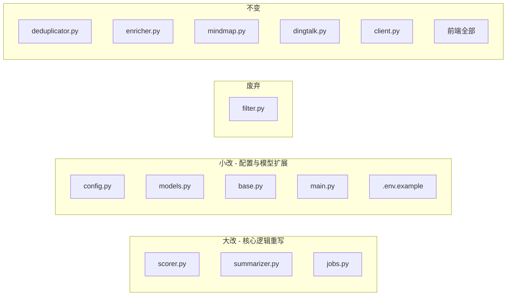
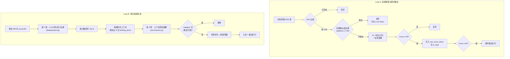

---

# 📐 V0.3 版本设计文档：个人旗舰版（显式个性化 + 3 层去重管线）

> **版本**：0.3  
> **更新日期**：2026-05-26  
> **状态**：设计中  
> **前置版本**：[V0.2版本设计文档](V0.2版本设计文档.md)  
> **需求来源**：[V0.3 版本需求文档](V0.3%20版本需求文档.md)  

## 1. 升级概述

### 1.1 核心目标

在不破坏 V0.2 轻量级架构（SQLite + FastAPI + Vue 3）的前提下，实现两大核心升级：

1. **显式个性化打分**：通过 `.env` 配置"主人画像"注入 LLM Prompt，让打分从"通用客观评分"进化为"专属匹配评分"
2. **3 层混合去重管线**：彻底解决跨源重复推送与历史旧闻重复上报问题

### 1.2 架构设计原则

| 原则 | 说明 |
|------|------|
| **单用户核心** | 不引入多用户表和并发更新逻辑，所有个性化通过环境变量配置 |
| **无痛兼容** | 不修改 `score` 字段语义，不重命名列，零数据迁移成本 |
| **Token 精细管控** | 废弃独立 `filter.py` 消除双重 LLM 调用；历史上下文设 soft limit |
| **最小变更面** | 仅改动必要模块，不动 `enricher.py`/`mindmap.py`/`dingtalk.py`/前端 |

### 1.3 与 V0.2 的变更对比

| 维度 | V0.2 | V0.3 |
|------|------|------|
| 打分逻辑 | 通用客观评分（`scorer.py`） | 注入个人画像的专属匹配评分 |
| 标签提取 | 无 | 打分时一并提取 `ai_tags` |
| AI 新闻过滤 | 独立 `filter.py` + LLM 调用 | **废弃**，内聚于打分阈值 |
| 去重（Loop A） | 仅 URL 精确去重 | URL + 标题编辑距离双重拦截 |
| 去重（Loop B） | LLM 同日语义去重 | 保留 + 新增跨天历史脉络去重 |
| 摘要生成 | 无上下文的独立摘要 | 注入近 N 天历史摘要的上下文感知摘要 |
| 数据清理 | `cleanup_memory` 已定义但未挂载 | 挂载到调度器定时执行 |

---

## 2. 变更影响范围

### 2.1 文件级变更清单



### 2.2 新增外部依赖

| 依赖包 | 用途 | 安装方式 |
|--------|------|---------|
| `rapidfuzz` | 标题文本编辑距离计算（模糊匹配） | `uv add rapidfuzz` |

---

## 3. 数据模型变更

### 3.1 ORM 模型变更 (`models.py`)

`RawNewsItem` 表新增一个字段：

```python
# 新增字段
ai_tags = Column(Text, default="[]")  # JSON: AI 提取的实体标签数组
```

**数据库迁移**：需要对已有数据库执行 `ALTER TABLE raw_news_items ADD COLUMN ai_tags TEXT DEFAULT '[]'`。

**完整字段列表**（变更后）：

| 字段 | 类型 | 变更状态 | 说明 |
|------|------|---------|------|
| `id` | Integer (PK) | 不变 | 自增主键 |
| `source` | String(100) | 不变 | 新闻来源 |
| `title` | String(500) | 不变 | 标题 |
| `url` | String(1000) | 不变 | 原文链接 |
| `description` | Text | 不变 | 描述/摘要 |
| `raw_content` | Text | 不变 | 原文内容 |
| `score` | Integer | **语义变更** | 从"客观分"变为"个性化专属匹配分"，字段名和类型不变 |
| `extra_data` | Text (JSON) | 不变 | 附加字段（含打分理由） |
| `ai_tags` | Text (JSON) | **新增** | AI 提取的实体标签，如 `["LLaMA 3", "微调"]` |
| `published_at` | String(50) | 不变 | 发布时间 |
| `is_pushed_instantly` | Boolean | 不变 | 是否已即时推送 |
| `collected_at` | DateTime | 不变 | 采集入库时间 |
| `briefing_date` | String(10) | 不变 | 所属日期 |

### 3.2 Pydantic Schema 变更 (`base.py`)

```python
class RawNewsItemSchema(BaseModel):
    """采集器输出的标准化新闻条目。"""

    source: str
    title: str
    url: str
    description: str = ""
    raw_content: str = ""
    score: int = 0
    extra_data: dict = Field(default_factory=dict)
    published_at: str = ""
    ai_tags: list[str] = Field(default_factory=list)  # 新增
```

---

## 4. 配置管理变更 (`config.py`)

### 4.1 新增配置项

```python
# 个性化画像
user_persona: str = Field(
    default="我是一名关注 AI 发展的技术人员，偏好开源项目和硬核技术解析，不看软文。",
    description="注入给 LLM 的私人画像描述",
)

# 去重
title_similarity_threshold: float = Field(
    default=0.85, description="Loop A 标题相似度硬拦截阈值"
)

# 历史上下文
context_lookback_days: int = Field(
    default=3, description="Loop B 向前追溯历史脉络的天数"
)
context_max_items: int = Field(
    default=45, description="Loop B 注入历史上下文的最大条数"
)

# 数据清理
cleanup_retention_days: int = Field(
    default=7, description="数据库垃圾数据保留天数"
)
cleanup_hour: int = Field(default=3, description="数据清理任务执行小时")
cleanup_minute: int = Field(default=0, description="数据清理任务执行分钟")
```

### 4.2 废弃配置项

以下配置项将从 `Settings` 类和 `.env.example` 中**移除**：

| 配置项 | 原因 |
|--------|------|
| `ai_filter_enabled` | `filter.py` 整体废弃 |
| `ai_filter_batch_size` | 同上 |
| `ai_filter_target_audience` | 功能被 `user_persona` 替代 |

### 4.3 完整配置项总览

| 分组 | 配置项 | 类型 | 默认值 | 状态 |
|------|--------|------|--------|------|
| 个性化 | `user_persona` | `str` | `关注AI发展的程序员...` | **新增** |
| 去重 | `title_similarity_threshold` | `float` | `0.85` | **新增** |
| 上下文 | `context_lookback_days` | `int` | `3` | **新增** |
| 上下文 | `context_max_items` | `int` | `45` | **新增** |
| 清理 | `cleanup_retention_days` | `int` | `7` | **新增** |
| 清理 | `cleanup_hour` | `int` | `3` | **新增** |
| 清理 | `cleanup_minute` | `int` | `0` | **新增** |
| 过滤 | `ai_filter_enabled` | — | — | **废弃** |
| 过滤 | `ai_filter_batch_size` | — | — | **废弃** |
| 过滤 | `ai_filter_target_audience` | — | — | **废弃** |

---

## 5. 模块详细设计

### 5.1 个性化打分模块 (`scorer.py`) — **大改**

#### 5.1.1 V0.2 → V0.3 变更要点

| 项目 | V0.2 | V0.3 |
|------|------|------|
| Prompt | 通用"AI 领域技术分析师" | 注入 `USER_PERSONA` 的"私人 AI 技术助理" |
| 返回值 | `{score, reason}` | `{score, analysis, ai_tags}` |
| `extra_data` 写入 | `score_reason` | `score_reason` (来自 `analysis`) |
| `ai_tags` 写入 | 无 | 解析后写入 `item.ai_tags` |

#### 5.1.2 新 Prompt 模板

```python
_PERSONALIZED_SCORING_PROMPT = """你是一个专属于我的私人 AI 技术助理。请根据我的【个人画像与偏好】，评估以下新闻对我的实际阅读价值。

## 👨‍💻 我的个人画像
{user_persona}

## 📰 新闻信息
- 来源：{source}
- 标题：{title}
- 摘要：{description}

## 📊 任务规则
1. 价值评估 (0-100分)：严格匹配我的画像。精准踩中痛点给 85 分以上；非关注领域或公关水文绝不超过 59 分。
2. 实体提取：提取 1-3 个核心专有名词作为标签。

请仅返回 JSON 格式：
{{
    "analysis": "评估理由",
    "score": 85,
    "ai_tags": ["标签1", "标签2"]
}}
"""
```

#### 5.1.3 函数签名变更

```python
def score_single_news(item: RawNewsItemSchema) -> RawNewsItemSchema:
    """为单条新闻打分并提取标签。

    变更：
    - 使用 USER_PERSONA 个性化 Prompt
    - 从 LLM 返回值中解析 ai_tags 并写入 item.ai_tags
    - 将 analysis 写入 item.extra_data["score_reason"]
    """
```

#### 5.1.4 降级策略

- LLM 调用失败：`score = 0`, `ai_tags = []`, `extra_data["score_reason"] = "AI 评估异常"`
- `ai_tags` 未返回或格式异常：降级为空列表 `[]`

---

### 5.2 上下文感知摘要模块 (`summarizer.py`) — **大改**

#### 5.2.1 V0.2 → V0.3 变更要点

| 项目 | V0.2 | V0.3 |
|------|------|------|
| Prompt | 无上下文的独立摘要 | 注入历史 `briefing_items` 作为"短期记忆" |
| 函数签名 | `summarize_single(title, source, url, description, content)` | 新增 `historical_context: str = ""` 参数 |
| 返回值 | `{one_line_summary, key_points, importance, category}` | 不变，但 `category` 可能返回 `[重复已阅]` |
| 去重能力 | 无 | LLM 判定跨天重复 → `category = "[重复已阅]"` |
| 脉络追踪 | 无 | LLM 识别后续进展 → 在摘要中标注 |

#### 5.2.2 新 Prompt 模板

```python
_CONTEXTUAL_SUMMARY_PROMPT = """你是一个资深的 AI 行业分析师。

【今日新闻】
- 标题：{title}
- 来源：{source}
- URL：{url}
- 描述：{description}
- 原文内容（部分）：{content}

【🧠 短期记忆：近期已阅资讯】
{historical_context}

【任务要求】
1. 去重判断：如果今日新闻与【短期记忆】中某件事完全是重复报道，请务必在 `category` 返回 `[重复已阅]`。
2. 脉络追踪：如果是【短期记忆】中某件事的后续进展，请在摘要中明确指出。
3. 摘要用中文撰写，语言简洁精准。

请返回 JSON：
{{
    "one_line_summary": "一句话概括",
    "key_points": ["要点1", "要点2", "结合历史脉络的分析"],
    "importance": "为什么重要",
    "category": "标签"
}}
"""
```

#### 5.2.3 函数签名变更

```python
def summarize_single(
    title: str,
    source: str,
    url: str,
    description: str,
    content: str,
    historical_context: str = "",  # 新增：历史摘要上下文
) -> dict:
```

**逻辑分支**：
- 若 `historical_context` 为空字符串 → 使用原有的无上下文 Prompt（向后兼容）
- 若 `historical_context` 非空 → 使用新的 `_CONTEXTUAL_SUMMARY_PROMPT`

#### 5.2.4 降级策略

不变：LLM 失败时返回 `{one_line_summary: 原标题, key_points: [], category: "其他"}`

---

### 5.3 AI 新闻过滤模块 (`filter.py`) — **废弃**

`filter.py` 将不再被任何代码引用。整个模块保留在文件系统中但标记为 deprecated。

**原因**：V0.3 个性化打分的分数阈值机制（`< 60 分不入库`）已天然包含过滤语义。

**影响点**：
- `jobs.py` 中 Loop B 的 `filter_ai_related()` 调用需要移除
- `config.py` 中 `ai_filter_enabled`、`ai_filter_target_audience`、`ai_filter_batch_size` 需移除

---

### 5.4 调度编排层变更 (`jobs.py`) — **大改**

#### 5.4.1 Loop A 变更：新增标题硬去重

**V0.2 流程**：

```
fetch_all_feeds → URL 去重 → AI 打分 → score >= 60 入库
```

**V0.3 流程**：

```
fetch_all_feeds → URL 去重 → 标题相似度去重(新增) → AI 打分(含标签提取) → score >= 60 入库(含 ai_tags)
```

**标题去重详细设计**：

```python
from rapidfuzz import fuzz

def _is_title_duplicate(
    new_title: str,
    existing_titles: list[str],
    threshold: float,
) -> bool:
    """判断新标题是否与已有标题过度相似。

    使用 rapidfuzz.fuzz.ratio 计算归一化编辑距离相似度 (0-100)。
    threshold 为 0.0-1.0 的浮点数，转换为 0-100 的整数比较。
    """
    target = int(threshold * 100)
    for existing in existing_titles:
        if fuzz.ratio(new_title, existing) >= target:
            return True
    return False
```

**执行位置**：在 URL 去重之后、AI 打分之前。查询数据库近 24 小时内 `score >= 60` 的所有 `title`。

**入库扩展**：`RawNewsItem` 构造时新增 `ai_tags=json.dumps(item.ai_tags, ensure_ascii=False)`。

#### 5.4.2 Loop B 变更：移除 filter + 新增历史上下文 + 跨天去重

**V0.2 流程**：

```
查询 48h 数据 → 语义去重 → AI 过滤 → Top N → 摘要+背景 → 思维导图 → 入库 → 推送
```

**V0.3 流程**：

```
查询 48h 数据 → 语义去重 → (AI 过滤已删除) → Top N
    → 构建历史上下文(新增) → 摘要+背景(含上下文) → 过滤[重复已阅](新增)
    → 思维导图 → 入库 → 推送
```

**历史上下文构建设计**：

```python
def _build_historical_context(session, settings) -> str:
    """构建过去 N 天的历史摘要上下文字符串。

    查询 briefing_items 表，按 briefing.date 倒序，
    最多取 CONTEXT_MAX_ITEMS 条。
    """
    from datetime import datetime, timedelta
    from zoneinfo import ZoneInfo

    local_tz = ZoneInfo(settings.timezone)
    cutoff_date = (
        datetime.now(local_tz) - timedelta(days=settings.context_lookback_days)
    ).strftime("%Y-%m-%d")

    history_items = (
        session.query(BriefingItem)
        .join(DailyBriefing)
        .filter(DailyBriefing.date >= cutoff_date)
        .order_by(DailyBriefing.date.desc(), BriefingItem.priority.asc())
        .limit(settings.context_max_items)
        .all()
    )

    if not history_items:
        return ""

    lines = []
    for item in history_items:
        lines.append(f"- [{item.briefing.date}] {item.title}：{item.one_line_summary}")

    return "\n".join(lines)
```

**`[重复已阅]` 过滤设计**：

在摘要生成完成、思维导图生成之前，过滤掉 `category` 包含 `[重复已阅]` 的条目：

```python
# 过滤跨天重复
processed_results = [
    r for r in processed_results
    if "[重复已阅]" not in r["summary"].get("category", "")
]
```

#### 5.4.3 `_process_digest_item` 变更

函数签名新增 `historical_context` 参数，传递给 `summarize_single`：

```python
def _process_digest_item(item, trigger_ddgs: bool, historical_context: str = "") -> dict:
    summary = summarize_single(
        title=item.title,
        source=item.source,
        url=item.url,
        description=item.description,
        content=item.raw_content,
        historical_context=historical_context,  # 新增
    )
    # ... 背景补充逻辑不变 ...
```

#### 5.4.4 `cleanup_memory` 变更

使用 `settings.cleanup_retention_days` 替代硬编码的 7 天：

```python
def cleanup_memory():
    """数据清理：删除过期的 raw_news_items。"""
    settings = get_settings()
    cutoff = datetime.now(timezone.utc) - timedelta(days=settings.cleanup_retention_days)
    # ... 其余逻辑不变，使用 RawNewsItem.collected_at < cutoff ...
```

---

### 5.5 应用入口变更 (`main.py`) — **小改**

新增清理任务的调度器注册：

```python
# Loop A、Loop B 注册不变...

# 数据清理任务（新增）
from briefing.scheduler.jobs import cleanup_memory
scheduler.add_job(
    cleanup_memory,
    trigger=CronTrigger(
        hour=settings.cleanup_hour,
        minute=settings.cleanup_minute,
        timezone=settings.timezone,
    ),
    id="cleanup_old_data",
    name="数据清理：过期数据删除",
    replace_existing=True,
)
```

日志输出新增：

```python
logger.info(
    "调度器已启动：\n"
    "- Loop A: 每 %d 分钟执行一次\n"
    "- Loop B: 每天 %02d:%02d 执行\n"
    "- 数据清理: 每天 %02d:%02d 执行",
    settings.rss_fetch_interval_minutes,
    settings.schedule_hour, settings.schedule_minute,
    settings.cleanup_hour, settings.cleanup_minute,
)
```

需从 imports 中**移除** `filter_ai_related`（如果存在的话），并新增导入 `cleanup_memory`。

---

## 6. 3 层去重管线完整流程

### 6.1 流程图



### 6.2 各层职责矩阵

| 层级 | 阶段 | 去重维度 | 实现方式 | 代价 |
|------|------|---------|---------|------|
| 第 1 层 | Loop A | 跨源同标题 | `rapidfuzz.fuzz.ratio` 文本相似度 | O(n×m) 字符串比较，无 LLM 调用 |
| 第 2 层 | Loop B | 同日跨源同事件 | `deduplicator.py` LLM 语义分析 | 1 次 LLM 调用 |
| 第 3 层 | Loop B | 跨天历史重复 | `summarizer.py` Prompt 注入历史上下文 | 每条新闻的摘要 Prompt 增加 ~500-1500 tokens |

---

## 7. Token 预算分析

### 7.1 Loop A 单条新闻 Token 消耗

| 模块 | V0.2 | V0.3 | 变化 |
|------|------|------|------|
| `scorer.py` | ~300 tokens | ~400 tokens (+画像文本) | +33% |
| `filter.py` | ~800 tokens/批 | 0（废弃） | -100% |
| **净效果** | — | — | **显著节约** |

### 7.2 Loop B 单条新闻 Token 消耗

| 模块 | V0.2 | V0.3 | 变化 |
|------|------|------|------|
| `deduplicator.py` | 不变 | 不变 | 0 |
| `summarizer.py` | ~500 tokens | ~1000-2000 tokens (+历史上下文) | +100-300% |
| `filter.py` | ~800 tokens/批 | 0（废弃） | -100% |
| **净效果** | — | — | 小幅增加 |

### 7.3 历史上下文 Token 预算控制

| 参数 | 值 | 说明 |
|------|-----|------|
| `CONTEXT_LOOKBACK_DAYS` | 3 天 | 向前追溯天数 |
| `CONTEXT_MAX_ITEMS` | 45 条 | 硬上限截断 |
| 每条文本量 | ~80-120 字符 | `[日期] 标题：一句话摘要` |
| 总文本量 | ~3600-5400 字符 | ≈ 1200-1800 tokens |

以主流模型的上下文窗口（128K tokens）来看，1500 tokens 的历史上下文开销完全可控。

---

## 8. 环境配置模板变更 (`.env.example`)

新增以下配置块：

```env
# ===== V0.3 个性化配置 =====
# 注入给 LLM 的私人画像，这段文字将直接出现在打分 Prompt 中
# 请详细描述你的职业角色、技术兴趣、不感兴趣的内容等
USER_PERSONA=我是一名关注 AI 发展的技术人员，偏好开源项目和硬核技术解析，不看软文。

# ===== V0.3 去重配置 =====
# Loop A 标题相似度硬拦截阈值（0.0-1.0），越高越严格
TITLE_SIMILARITY_THRESHOLD=0.85

# ===== V0.3 上下文配置 =====
# Loop B 生成摘要时，向 LLM 喂入过去几天的历史早报作为短期记忆
CONTEXT_LOOKBACK_DAYS=3
# 历史上下文最大注入条数（防止 Token 溢出）
CONTEXT_MAX_ITEMS=45

# ===== V0.3 数据清理配置 =====
# 原始新闻数据保留天数
CLEANUP_RETENTION_DAYS=7
# 清理任务执行时间
CLEANUP_HOUR=3
CLEANUP_MINUTE=0
```

移除以下配置块：

```diff
- # 是否开启 AI 初筛与打分机制（true/false）
- AI_FILTER_ENABLED=true
- # AI 批量过滤和打分时，单次同时处理的新闻条目数量
- AI_FILTER_BATCH_SIZE=50
- # AI 评估新闻价值的"目标人群"
- AI_FILTER_TARGET_AUDIENCE=AI 开发者、AI 研究员和关注大模型应用的技术团队
```

---

## 9. 测试计划

### 9.1 新增测试文件

| 测试文件 | 覆盖模块 | 关键测试场景 |
|---------|---------|------------|
| `tests/test_title_dedup.py` | Loop A 标题去重 | 相似标题拦截、不相似标题放行、空标题处理、阈值边界 |
| `tests/test_personalized_scorer.py` | `scorer.py` V0.3 | 个性化 Prompt 注入验证、`ai_tags` 解析、降级行为 |
| `tests/test_contextual_summary.py` | `summarizer.py` V0.3 | 历史上下文注入验证、`[重复已阅]` 标记、无上下文回退 |

### 9.2 现有测试修改

| 测试文件 | 需要修改的原因 |
|---------|--------------|
| `tests/test_ai_processor.py` | `scorer` 相关用例需适配新返回值 `ai_tags`；`filter` 相关用例需移除或标记 skip |
| `tests/test_scheduler_jobs.py` | `_process_digest_item` 签名变更需适配 |

### 9.3 测试运行方式

```powershell
# 运行全部测试
uv run pytest -v

# 只运行 V0.3 新增测试
uv run pytest tests/test_title_dedup.py tests/test_personalized_scorer.py tests/test_contextual_summary.py -v
```

---

## 10. 数据库迁移方案

由于项目未引入 Alembic，采用手动 SQL 迁移：

```sql
-- V0.3 迁移脚本
ALTER TABLE raw_news_items ADD COLUMN ai_tags TEXT DEFAULT '[]';
```

或通过 Python 脚本执行：

```python
from sqlalchemy import text
from briefing.database import get_engine

def migrate_v03():
    engine = get_engine()
    with engine.connect() as conn:
        conn.execute(text("ALTER TABLE raw_news_items ADD COLUMN ai_tags TEXT DEFAULT '[]'"))
        conn.commit()
    print("V0.3 迁移完成：ai_tags 列已添加")
```

**替代方案**：删除 `data/briefing.db` 并重启应用，由 `create_all()` 自动建表（会丢失历史数据）。

---

## 11. 实施顺序建议

为降低风险和方便验证，建议按以下顺序实施：

```mermaid
gantt
    title V0.3 实施顺序
    dateFormat X
    axisFormat %s

    section 第一阶段：数据层
    config.py 新增配置项       :a1, 0, 1
    models.py + base.py 新增字段  :a2, 1, 2
    数据库迁移                   :a3, 2, 3

    section 第二阶段：打分改造
    scorer.py Prompt 重写      :b1, 3, 5
    scorer 单元测试             :b2, 5, 6

    section 第三阶段：去重管线
    Loop A 标题去重             :c1, 6, 8
    标题去重单元测试            :c2, 8, 9

    section 第四阶段：上下文摘要
    summarizer.py 改造         :d1, 9, 11
    上下文摘要单元测试          :d2, 11, 12

    section 第五阶段：编排集成
    jobs.py 集成改造            :e1, 12, 15
    filter.py 废弃 + 清理挂载   :e2, 15, 16
    main.py 注册清理任务        :e3, 16, 17

    section 第六阶段：验证
    全量测试 + .env 更新        :f1, 17, 19
```



### 步骤清单

- [ ] 1. `config.py`：新增 7 个配置项，移除 3 个废弃项
- [ ] 2. `models.py`：`RawNewsItem` 新增 `ai_tags` 列
- [ ] 3. `base.py`：`RawNewsItemSchema` 新增 `ai_tags` 字段
- [ ] 4. 数据库迁移：`ALTER TABLE` 添加 `ai_tags` 列
- [ ] 5. `scorer.py`：Prompt 重写 + 解析 `ai_tags` + 注入 `USER_PERSONA`
- [ ] 6. 新增 `tests/test_personalized_scorer.py`
- [ ] 7. `jobs.py` Loop A：新增标题相似度去重 + `ai_tags` 入库
- [ ] 8. 新增 `tests/test_title_dedup.py`
- [ ] 9. `summarizer.py`：新增 `historical_context` 参数 + 新 Prompt
- [ ] 10. 新增 `tests/test_contextual_summary.py`
- [ ] 11. `jobs.py` Loop B：移除 `filter_ai_related` 调用 + 构建历史上下文 + `[重复已阅]` 过滤
- [ ] 12. `main.py`：注册 `cleanup_memory` 定时任务
- [ ] 13. `jobs.py` `cleanup_memory`：使用 `CLEANUP_RETENTION_DAYS` 配置
- [ ] 14. `.env.example`：新增 V0.3 配置块 + 移除废弃项
- [ ] 15. 更新现有测试用例，移除 filter 相关测试
- [ ] 16. 全量测试通过

---
